# Sistema de Scraping de Mercado Libre Uruguay

Sistema de scraping automatizado para Mercado Libre Uruguay con arquitectura publisher-subscriber usando RabbitMQ y persistencia en PostgreSQL (Supabase).

## 🏗️ Arquitectura

```
Publisher → RabbitMQ → Subscriber Listener → Scraper Service → PostgreSQL (Supabase)
    ↓           ↓              ↓              ↓              ↓
  API REST   Message Queue   Message      Browser         Database
  (Port 8001)                Consumer     Automation      Persistencia
```

## 🚀 Servicios

- **RabbitMQ**: Message broker (Puerto 15672 para management)
- **Publisher**: API para enviar tareas de scraping (Puerto 8001)
- **Subscriber**: API REST para consultar estado (Puerto 8002)
- **Subscriber Listener**: Worker que procesa mensajes de la cola
- **PostgreSQL (Supabase)**: Base de datos para persistir productos scrapeados

## 📋 Prerrequisitos

- Docker y Docker Compose
- Python 3.11+
- Poetry (para desarrollo local)
- Cuenta de Supabase (PostgreSQL)


## Casos de uso

```mermaid
graph LR
    %% Definición de actores como nodos
    Cliente([👤 Cliente])
    Monitor([🖥️ Sistema de Monitoreo])

    %% Casos de uso como óvalos
    UC_Scrape(("Iniciar Scrape"))
    UC_Health(("Health Check"))

    UC_Publicar(("Publicar solicitud de scraping"))
    UC_Validar(("Validar parámetros"))
    UC_Encolar(("Encolar mensaje en RabbitMQ"))
    UC_Responder(("Responder aceptación de tarea"))
    UC_Verificar(("Verificar estado del servicio"))

    %% Relaciones de actores con casos de uso principales
    Cliente --> UC_Scrape
    Monitor --> UC_Health

    %% Relaciones include (simuladas con flechas punteadas)
    UC_Scrape -.-> UC_Publicar
    UC_Scrape -.-> UC_Validar
    UC_Scrape -.-> UC_Encolar
    UC_Scrape -.-> UC_Responder

    UC_Health -.-> UC_Verificar

```




## 🛠️ Instalación y Uso

### 1. Clonar el repositorio
```bash
git clone <repository-url>
cd test-scrapping
```

### 2. Configurar Base de Datos (PostgreSQL - Supabase)
```bash
# 1. Crear proyecto en Supabase
# 2. Ejecutar subscriber/database/products.sql en SQL Editor
# 3. Configurar variables de entorno en subscriber/.env
```

### 3. Levantar servicios

#### Para equipos de Mercado Libre (usando Poetry):
```bash
# 1. Levantar RabbitMQ
docker-compose up rabbitmq -d

# 2. En terminal 1 - Publisher
cd publisher
poetry install
poetry run start

# 3. En terminal 2 - Subscriber API
cd subscriber
poetry install
poetry run start-api

# 4. En terminal 3 - Subscriber Listener
cd subscriber
poetry run start-listener
```

#### Para equipos externos (usando Docker):
```bash
# Construir y levantar todos los servicios
docker-compose up -d

# O paso a paso
docker-compose up rabbitmq -d
docker-compose up publisher -d  
docker-compose up subscriber -d
```

### 4. Verificar estado de los servicios
```bash
# Verificar servicios
docker ps

# Verificar logs específicos
docker logs rabbitmq
docker logs publisher
docker logs subscriber
```

## 🧪 Testing

Ver documentación detallada en [`docs/DEVELOPMENT.md`](docs/DEVELOPMENT.md)

### Tests con Poetry (Recomendado para dev de MELI):
```bash
# Publisher
cd publisher && poetry run test

# Subscriber  
cd subscriber && poetry run pytest tests/ -v --cov=. --cov-report=term-missing
```


## 📁 Estructura del Proyecto

```
├── adicionales/rabbitmq/     # Configuración de RabbitMQ
├── publisher/                 # Servicio publisher (API REST)
├── subscriber/               # Servicio subscriber + listener
│   ├── database/             # Configuración PostgreSQL/Supabase
│   ├── manager/              # Gestión de colas y workers
│   ├── scraper/              # Lógica de scraping
│   └── tests/                # Tests unitarios
├── validation_ia/            # Sistema de validación con IA
├── docs/                     # Documentación detallada
├── docker-compose.yml        # Orquestación de servicios
└── README.md                 # Este archivo
```

## 🔄 Flujo de Trabajo


1. **Publisher** recibe solicitud de scraping via API REST
2. **Publisher** envía mensaje a RabbitMQ
3. **Subscriber Listener** recibe mensaje de la cola
4. **Subscriber Listener** ejecuta scraping con Playwright
5. **Subscriber Listener** guarda productos en PostgreSQL (Supabase)
6. **Subscriber Listener** actualiza estado de la tarea
7. **Subscriber API** permite consultar estado y resultados

## Paso a Paso - Detalle 
En el localhost:8002/docs#/default/publish_scraping_request_publish_post

para produccion:

http://34.58.117.158:8002/docs#/default/publish_scraping_request_publish_post

```json
{
  "url": "https://www.mercadolibre.com.uy/ofertas?",
  "category": "MLU1384",
  "page": 1
}
```

Donde enviara la peticion para extraer todos los elementos de esa pagina definida y para esa categoria.

Los resultados se podran ver en la base de datos o en su defecto, a traves de los logs.


## 📝 Variables de Entorno

Para subscriber:
El archivo de `.env` debe estar en la ruta `subscriber/.env`

Para Validation IA (punto numero 2 ) :
El archivo de `.env` debe estar en la ruta `subscriber/.env`

## 📚 Documentación Detallada

Para información más completa, consulta la carpeta [`docs/`](docs/):

- 🚀 **[Guía de Despliegue](docs/DEPLOYMENT.md)**: Proceso paso a paso para poner en funcionamiento el sistema
- 🛠️ **[Guía de Desarrollo](docs/DEVELOPMENT.md)**: Información técnica para desarrolladores, tests y arquitectura
- 📖 **[Índice de Documentación](docs/README.md)**: Navegación y enlaces rápidos
- **[Detalles para Validation IA](validation_ia\README.md)**


# Parte 2 
## 🚀 Entrypoint

El sistema tiene **un único punto de entrada**:

```bash

cd validation_ia

poetry run python main.py
```

Por favor ver con mas detalle en  **[Detalles para Validation IA](validation_ia\README.md)** .

